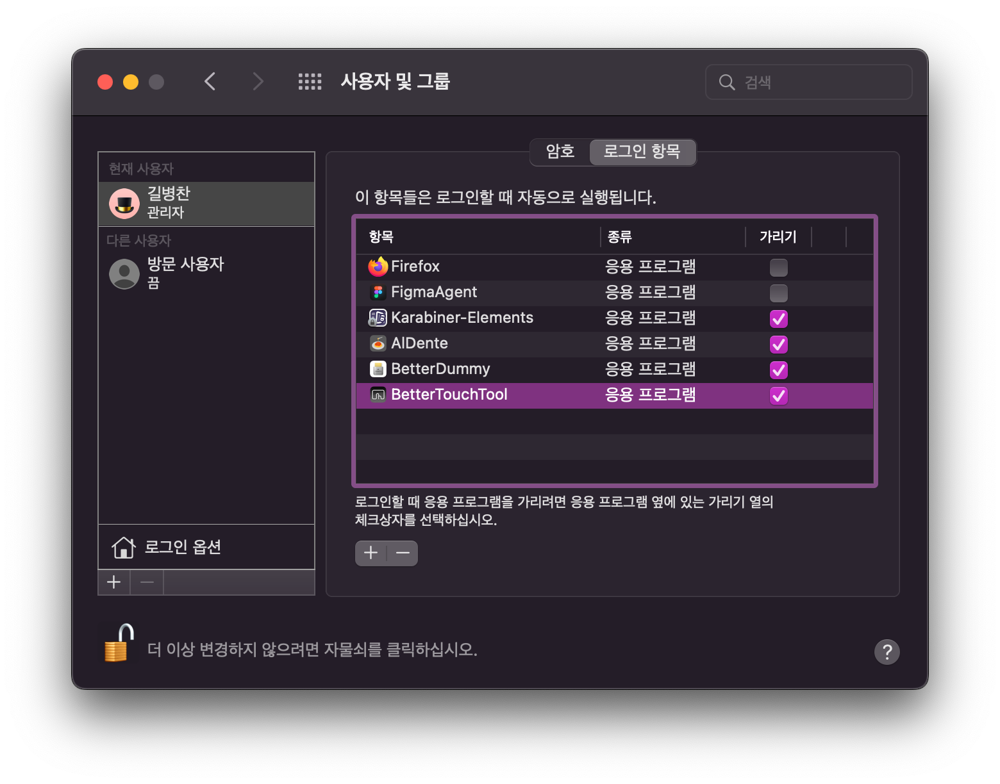
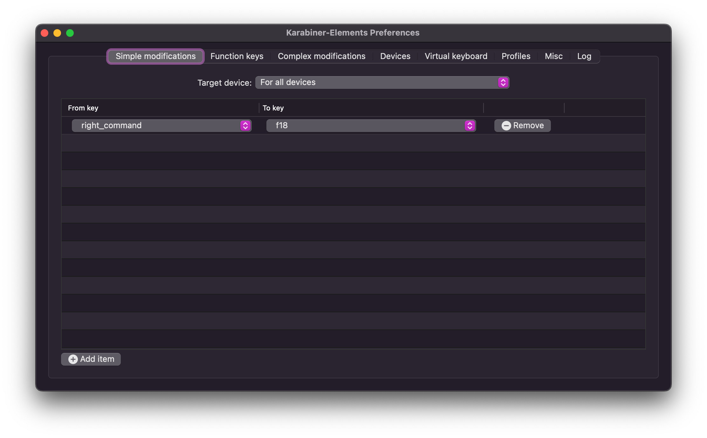

# dotfiles.macos

## Prerequisites

0. homebrew
0. oh-my-zsh

## Installation

```sh
# REF: https://github.com/Homebrew/homebrew-bundle
brew bundle

# configure oh-my-zsh
bash omz/configure.sh
```

After the installation, edit your `$HOME/.zshrc`.
`omz/.zshrc` is not complete rc file.
It's there only just for you to refer to.
You do not have to copy-paste it to `$HOME/.zshrc`.

Open a **new** shell.
Then install global gem packages.

```sh
# REF: https://github.com/athityakumar/colorls#installation
gem install colorls
```

## Maintenance

```sh
# Update(Overwrite) Brewfile 
rm -rf Brewfile && brew bundle dump
```

## Settings

### System



### Karabiner



After setting Karabiner, You also should configure input change key - the "Select next source in input menu" key - to `f18`.

## License

MIT License. Copyright © 2022, GIL B. Chan <github.com/jjangga0214> <bnbcmindnpass@gmail.com>
